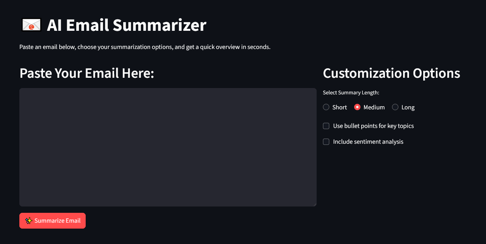

# 📧 AI Email Summarizer

An intelligent web application that uses the OpenAI API to summarize long emails, helping you save time and quickly grasp key information. The app features a clean, interactive interface built with Streamlit, a robust backend powered by Python and PostgreSQL, and is fully containerized with Docker for easy setup and deployment.



## ✨ Features

- **AI-Powered Summarization**: Leverages the power of OpenAI's language models to generate concise and accurate summaries of any email text.
- **Customizable Summaries**: Tailor the summary to your needs with options for:
  - **Length**: Choose between Short, Medium, or Long summaries.
  - **Format**: Opt for bullet points to highlight key topics and action items.
  - **Analysis**: Include a sentiment analysis (Positive, Neutral, Negative) of the email's tone.
- **Persistent History**: All your generated summaries are automatically saved to a PostgreSQL database, so you never lose them.
- **Full-Text Search**: Easily search through your entire summary history using keywords to find exactly what you're looking for.
- **Containerized**: The entire application stack (Streamlit app, PostgreSQL database) is managed with Docker and Docker Compose for one-command setup.

## 🛠️ Tech Stack

This project is built with a modern and robust set of tools:

- **Frontend**:
  - [Streamlit](https://streamlit.io/): For building the interactive web-based GUI.
- **Backend**:
  - [Python 3.13](https://www.python.org/): Core application language.
  - [OpenAI API](https://openai.com/): For the AI summarization capabilities.
- **Database**:
  - [PostgreSQL](https://www.postgresql.org/): For storing email and summary data.
  - [SQLAlchemy](https://www.sqlalchemy.org/): As the ORM for database interaction.
  - [Alembic](https://alembic.sqlalchemy.org/): For handling database schema migrations.
- **DevOps & Tooling**:
  - [Docker & Docker Compose](https://www.docker.com/): For containerizing the application and its services.
  - [uv](https://github.com/astral-sh/uv): An extremely fast Python package installer and resolver, used for dependency management.
  - [Ruff](https://github.com/astral-sh/ruff): For high-performance code linting and formatting.
  - [pre-commit](https://pre-commit.com/): For running automated checks before every commit to ensure code quality.

## 🚀 Installation & Setup

1.  **Clone the repository:**
    ```sh
    git clone https://github.com/your-username/ai-email-summarizer.git
    cd ai-email-summarizer
    ```

2.  **Create and configure the environment file:**
    Copy the example environment file to create your own configuration.
    ```sh
    cp .env.example .env
    ```
    Now, open the `.env` file and fill in the required values.
    - `OPENAI_API_KEY`: Your secret key from the [OpenAI Platform](https://platform.openai.com/api-keys).
    - `DATABASE_URL`: The pre-configured URL for the Dockerized PostgreSQL database. You generally don't need to change this.

    Your `.env` file should look like this:
    ```env
    # .env
    OPENAI_API_KEY=sk-xxxxxxxxxxxxxxxxxxxxxxxxxxxx
    DATABASE_URL=postgresql://user:password@db:5432/summarizer_db
    ```

3.  **Build and run the application with Docker Compose:**
    This command will build the Docker images, start the containers for the Streamlit app and the PostgreSQL database, and run the necessary database migrations using Alembic.
    ```sh
    docker-compose up -d --build
    ```

4.  **Access the application:**
    Once the containers are up and running, you can access the AI Email Summarizer in your browser at:
    **[http://localhost:8501](http://localhost:8501)**

## 📂 Project Structure

The project follows a modular structure to keep the code organized and maintainable.

```
ai-email-summarizer/
├── .github/                  # GitHub Actions, issue templates, etc.
├── alembic/                  # Alembic migration scripts
│   └── versions/
├── src/                      # Main source code directory
│   ├── database/             # Database connection, models, and CRUD operations
│   │   ├── crud.py
│   │   ├── database.py
│   │   └── models.py
│   ├── pages/                # Individual Streamlit pages
│   │   ├── summarize_page.py
│   │   ├── history_page.py
│   │   └── search_page.py
│   ├── services/             # Business logic (e.g., interacting with OpenAI)
│   │   └── llm.py
│   ├── ui/                   # Reusable UI components
│   │   └── components.py
│   ├── app.py                # Main Streamlit application entrypoint
│   └── constants.py          # Application-wide constants
├── .env.example              # Example environment variables
├── .gitignore
├── .pre-commit-config.yaml   # Pre-commit hook configurations
├── docker-compose.yml               # Docker Compose configuration
├── Dockerfile                # Dockerfile for the application service
├── entrypoint.sh             # Script to run migrations and start the app
├── pyproject.toml            # Project metadata and dependencies (for uv)
└── README.md
```

## 📄 License

This project is licensed under the MIT License. See the `LICENSE` file for more details.
